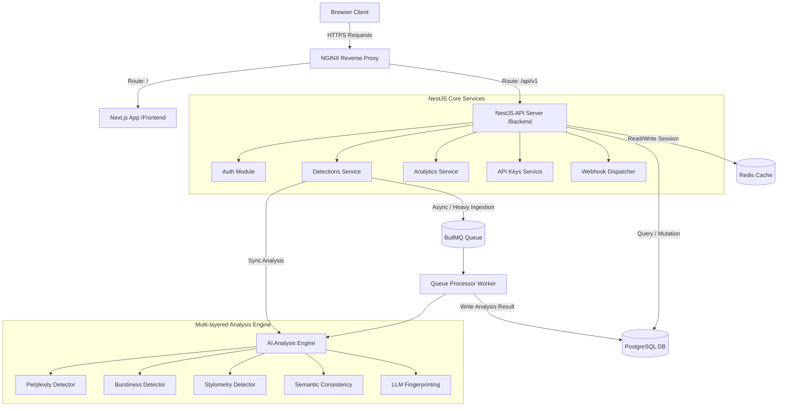
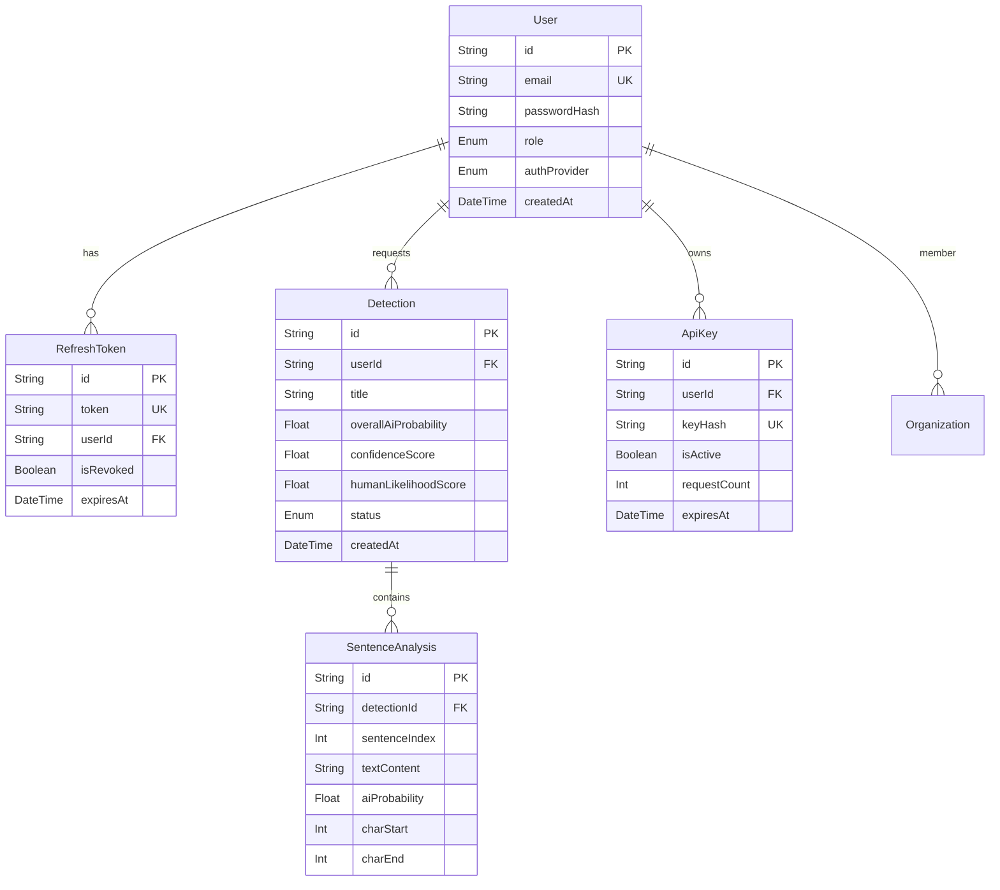

# VeriText Platform

[](https://nextjs.org/)
[](https://nestjs.com/)
[](https://www.typescriptlang.org/)
[](https://www.postgresql.org/)
[](https://www.prisma.io/)
[](https://redis.io/)
[](https://bullmq.io/)
[](https://www.docker.com/)
[](./.github/workflows/ci.yml)
[](./package.json)
[](https://gsap.com/)

VeriText is a complete, enterprise-grade AI Writing Authenticity & Intelligence Platform designed to verify text origin, analyze writing patterns, and detect AI-generated content. Engineered to meet the strict standards of top-tier Silicon Valley startups, VeriText is tailored for:

- **Universities** (academic integrity, verification of student submissions)
- **Enterprises** (trust, safety, and brand compliance verification)
- **Recruiters** (validating candidate-written responses and portfolios)
- **Publishers** (ensuring content authenticity and originality before release)
- **Researchers** (stylometric analysis and quantitative linguistic evaluations)
- **Content Platforms** (moderating massive user-generated content at scale)

Unlike simple binary AI classifiers, VeriText utilizes a multi-layered heuristic and statistical detection engine, delivering granular analysis including sentence-level probability heatmaps, linguistic complexity scores, readability metrics, and source style fingerprinting (attributing content signatures to models like ChatGPT, Claude, Gemini, or Llama).

---

## 🎯 Product Scope

VeriText is designed from the ground up for high-accuracy analysis, production-grade scalability, clean architecture, and premium user experience (UX).

### 🚀 Core Platform Objectives

1. **Linguistic AI Detection**: Identify AI-generated text using advanced statistical properties without relying solely on simple keywords.
2. **Writing Authenticity Analysis**: Assess stylistic variation, syntactic complexity, and sentence variety to gauge human origin likelihood.
3. **Suspicious Pattern Highlighting**: Pinpoint anomalous sections with visual interactive highlighting and real-time sentence-level feedback.
4. **LLM Style Attribution**: Estimate styling fingerprints to attribute text to likely AI creators (ChatGPT, Claude, Gemini, Llama).
5. **Advanced Statistical Analytics**: Provide visual representation of text properties, including perplexity trends, burstiness distributions, and sentence length statistics.
6. **Robust Ingestion Pipeline**: Support raw text input alongside document uploads for formats like `PDF`, `DOCX`, and `TXT`.
7. **Scale & Performance**: Handle heavy content processing via an asynchronous, queue-based background worker architecture.
8. **Developer-First API Ecosystem**: Provide fully versioned REST endpoints, secure API Keys, usage quotas, and event-driven webhook relays.

---

## 🧰 Tech Stack Matrix

| Layer                    | Technology                             | Details                                                                                                                                                  |
| :----------------------- | :------------------------------------- | :------------------------------------------------------------------------------------------------------------------------------------------------------- |
| **Frontend Framework**   | **Next.js 16 (App Router)**            | Strict route organization, server-side page layout layout hydration, and static optimization.                                                            |
| **Frontend Language**    | **TypeScript (Strict Mode)**           | Complete type safety, strict compile checks, and end-to-end interface binding.                                                                           |
| **Styling & UI System**  | **TailwindCSS + shadcn/ui**            | Clean professional SaaS design system (inspired by Linear and Vercel) featuring glassmorphism, dynamic dark/light mode, and mobile-first responsiveness. |
| **Animations**           | **Framer Motion**                      | Premium micro-animations, slide-overs, progress meters, and navigation transitions.                                                                      |
| **Client State**         | **Zustand**                            | Lightweight, high-performance client state hooks for theme, auth context, and workspace memory.                                                          |
| **Form Management**      | **React Hook Form + Zod**              | Declarative state binding with automated schema schema-based inputs validation.                                                                          |
| **Data Fetching**        | **TanStack Query (v5) + Axios**        | Cache lifecycle management, retry thresholds, optimistic UI updating, and automated polling.                                                             |
| **Backend Framework**    | **NestJS 11**                          | Modular, enterprise backend structure following SOLID principles, CQRS patterns, and clean architecture.                                                 |
| **ORM & Database**       | **Prisma ORM + PostgreSQL 16**         | Robust relational model, custom migration scripts, index constraints, and optimized relational queries.                                                  |
| **Caching & Queues**     | **Redis 7 + BullMQ**                   | Redis-driven fast cache store and distributed queue system for asynchronous analysis.                                                                    |
| **Authentication**       | **Passport.js (JWT & OAuth2)**         | Stateless JWT strategy, refresh token rotation (RTR), session guards, Google OAuth, and GitHub OAuth integrations.                                       |
| **Security & Hardening** | **Helmet + Rate-Limiting + DOMPurify** | Throttling limits (`@nestjs/throttler`), secure cookie storage, XSS, CSRF, and prompt-injection defenses.                                                |
| **DevOps / Infra**       | **Docker + Compose + NGINX**           | Production-ready multi-container environments, reverse-proxy routing, and environment parameters configuration.                                          |
| **Quality Gates**        | **ESLint + Prettier + Husky**          | Automatic code formatting, strict TypeScript rules, and commit message standardization (`commitlint`).                                                   |
| **Observability**        | **Sentry + Prometheus + Grafana**      | Global performance metrics collections (`/api/v1/metrics`), exception logs, and queue latency graphs.                                                    |

---

## 🏗️ Architecture Overview

The system is structured as an enterprise-grade monorepo splitting client interfaces from API servers using **npm workspaces**.



### Key Architectural Pillars

- **Clean Architecture & Decoupled Layout**: Each module is self-contained. The service layer handles business rules independent of HTTP delivery protocols, and access to storage layers is fully abstracted behind repositories.
- **Asynchronous Task Queuing**: Large text files are delegated to BullMQ. This prevents blocking web workers and allows system resources to scale horizontally.
- **Explainable Multi-Heuristic Verification**: The platform evaluates text structure, sentence variety (burstiness), text predictability (perplexity), stylometric habits, and contextual drift. A weighted mathematical model merges these signals into an unified rating.
- **Observability and Telemetry**: Built-in Prometheus metrics export, request logging interceptors, and a global exception filter that formats NestJS backend errors into predictable, structured API responses.

---

## 🗂️ Frontend Monorepo Structure

```text
📦 frontend-veritext-platform/
├── 📁 .github
│   └── 📁 workflows
│       └── ⚙️ ci.yml
├── 📁 .husky
│   ├── 📄 commit-msg
│   └── 📄 pre-commit
├── 📁 public
│   ├── 🖼️ file.svg
│   ├── 🖼️ globe.svg
│   ├── 🖼️ next.svg
│   ├── 🖼️ vercel.svg
│   ├── 🖼️ veritext-hero-dashboard.webp
│   ├── 🖼️ veritext-logo-application-dark-mode.webp
│   ├── 🖼️ veritext-logo-application-light-mode.webp
│   └── 🖼️ window.svg
├── 📁 src
│   ├── 📁 app
│   │   ├── 📁 auth
│   │   │   ├── 📁 find-account
│   │   │   │   └── 📄 page.tsx
│   │   │   ├── 📁 forgot-password
│   │   │   │   └── 📄 page.tsx
│   │   │   ├── 📁 login
│   │   │   │   └── 📄 page.tsx
│   │   │   ├── 📁 register
│   │   │   │   └── 📄 page.tsx
│   │   │   └── 📁 reset-password
│   │   │       └── 📄 page.tsx
│   │   ├── 📁 dashboard
│   │   │   ├── 📁 admin
│   │   │   │   └── 📄 page.tsx
│   │   │   ├── 📁 analytics
│   │   │   │   └── 📄 page.tsx
│   │   │   ├── 📁 api
│   │   │   │   └── 📄 page.tsx
│   │   │   ├── 📁 billing
│   │   │   │   └── 📄 page.tsx
│   │   │   ├── 📁 detector
│   │   │   │   └── 📄 page.tsx
│   │   │   ├── 📁 history
│   │   │   │   └── 📄 page.tsx
│   │   │   ├── 📁 humanizer
│   │   │   │   └── 📄 page.tsx
│   │   │   ├── 📁 profile
│   │   │   │   └── 📄 page.tsx
│   │   │   ├── 📄 layout.tsx
│   │   │   └── 📄 page.tsx
│   │   ├── 📁 ops
│   │   │   ├── 📁 alerts
│   │   │   │   └── 📄 page.tsx
│   │   │   ├── 📁 database
│   │   │   │   └── 📄 page.tsx
│   │   │   ├── 📁 health
│   │   │   │   └── 📄 page.tsx
│   │   │   ├── 📁 jobs
│   │   │   │   ├── 📁 active
│   │   │   │   │   └── 📄 page.tsx
│   │   │   │   ├── 📁 failed
│   │   │   │   │   └── 📄 page.tsx
│   │   │   │   └── 📁 history
│   │   │   │       └── 📄 page.tsx
│   │   │   ├── 📁 logs
│   │   │   │   ├── 📁 audit
│   │   │   │   │   └── 📄 page.tsx
│   │   │   │   ├── 📁 errors
│   │   │   │   │   └── 📄 page.tsx
│   │   │   │   └── 📁 live
│   │   │   │       └── 📄 page.tsx
│   │   │   ├── 📁 queues
│   │   │   │   └── 📄 page.tsx
│   │   │   ├── 📁 redis
│   │   │   │   └── 📄 page.tsx
│   │   │   ├── 📄 layout.tsx
│   │   │   └── 📄 page.tsx
│   │   ├── 📄 error.tsx
│   │   ├── 🎨 globals.css
│   │   ├── 📄 layout.tsx
│   │   └── 📄 page.tsx
│   ├── 📁 components
│   │   ├── 📁 analysis
│   │   │   ├── 📄 AiFingerprintBadge.tsx
│   │   │   ├── 📄 ConfidenceMeter.tsx
│   │   │   ├── 📄 DetectionHeatmap.tsx
│   │   │   └── 📄 DiffView.tsx
│   │   ├── 📁 common
│   │   │   ├── 📄 EmptyState.tsx
│   │   │   ├── 📄 auth-guard.tsx
│   │   │   ├── 📄 auth-language-toggle.tsx
│   │   │   ├── 📄 auth-page-fallback.tsx
│   │   │   ├── 📄 brand-logo.tsx
│   │   │   ├── 📄 country-flag.tsx
│   │   │   ├── 📄 guest-only.tsx
│   │   │   ├── 📄 pagination-controls.tsx
│   │   │   ├── 📄 password-input.tsx
│   │   │   └── 📄 theme-toggle.tsx
│   │   ├── 📁 dashboard
│   │   │   ├── 📄 HistoryTable.tsx
│   │   │   ├── 📄 detection-trend-chart.tsx
│   │   │   └── 📄 overview-cards.tsx
│   │   ├── 📁 detection
│   │   │   ├── 📄 detection-charts.tsx
│   │   │   ├── 📄 detection-result-skeleton.tsx
│   │   │   ├── 📄 detection-summary.tsx
│   │   │   ├── 📄 detector-form.tsx
│   │   │   ├── 📄 sentence-heatmap.tsx
│   │   │   └── 📄 upload-area.tsx
│   │   ├── 📁 history
│   │   │   └── 📄 history-table.tsx
│   │   ├── 📁 layout
│   │   │   ├── 📄 dashboard-shell.tsx
│   │   │   ├── 📄 floating-scrollbar.tsx
│   │   │   ├── 📄 marketing-header.tsx
│   │   │   └── 📄 site-footer.tsx
│   │   ├── 📁 marketing
│   │   │   ├── 📄 capabilities-section.tsx
│   │   │   ├── 📄 hero-section.tsx
│   │   │   ├── 📄 product-sections.tsx
│   │   │   └── 📄 security-section.tsx
│   │   ├── 📁 ops
│   │   │   ├── 📄 data-table.tsx
│   │   │   ├── 📄 gauge-chart.tsx
│   │   │   ├── 📄 live-indicator.tsx
│   │   │   ├── 📄 metric-card.tsx
│   │   │   ├── 📄 queue-progress-bar.tsx
│   │   │   ├── 📄 sparkline-chart.tsx
│   │   │   ├── 📄 status-badge.tsx
│   │   │   ├── 📄 terminal.tsx
│   │   │   └── 📄 uptime-bar.tsx
│   │   ├── 📁 profile
│   │   │   └── 📄 profile-form.tsx
│   │   ├── 📁 providers
│   │   │   ├── 📄 app-providers.tsx
│   │   │   ├── 📄 auth-provider.tsx
│   │   │   ├── 📄 i18n-provider.tsx
│   │   │   ├── 📄 query-provider.tsx
│   │   │   └── 📄 theme-provider.tsx
│   │   ├── 📁 ui
│   │   │   ├── 📄 alert-dialog.tsx
│   │   │   ├── 📄 avatar.tsx
│   │   │   ├── 📄 badge.tsx
│   │   │   ├── 📄 button.tsx
│   │   │   ├── 📄 card.tsx
│   │   │   ├── 📄 chart.tsx
│   │   │   ├── 📄 dropdown-menu.tsx
│   │   │   ├── 📄 input.tsx
│   │   │   ├── 📄 label.tsx
│   │   │   ├── 📄 progress.tsx
│   │   │   ├── 📄 select.tsx
│   │   │   ├── 📄 separator.tsx
│   │   │   ├── 📄 sheet.tsx
│   │   │   ├── 📄 skeleton.tsx
│   │   │   ├── 📄 sonner.tsx
│   │   │   ├── 📄 table.tsx
│   │   │   ├── 📄 tabs.tsx
│   │   │   ├── 📄 textarea.tsx
│   │   │   └── 📄 tooltip.tsx
│   │   └── 📁 upload
│   │       └── 📄 FileDropzone.tsx
│   ├── 📁 hooks
│   │   └── 📄 use-auth.ts
│   ├── 📁 i18n
│   │   ├── 📁 admin
│   │   │   ├── ⚙️ ar.json
│   │   │   ├── ⚙️ de.json
│   │   │   ├── ⚙️ en.json
│   │   │   ├── ⚙️ es.json
│   │   │   ├── ⚙️ fr.json
│   │   │   ├── ⚙️ hi.json
│   │   │   ├── ⚙️ id.json
│   │   │   ├── ⚙️ ja.json
│   │   │   ├── ⚙️ ko.json
│   │   │   ├── ⚙️ pt.json
│   │   │   ├── ⚙️ ru.json
│   │   │   └── ⚙️ zh.json
│   │   ├── 📁 analytics
│   │   │   ├── ⚙️ ar.json
│   │   │   ├── ⚙️ de.json
│   │   │   ├── ⚙️ en.json
│   │   │   ├── ⚙️ es.json
│   │   │   ├── ⚙️ fr.json
│   │   │   ├── ⚙️ hi.json
│   │   │   ├── ⚙️ id.json
│   │   │   ├── ⚙️ ja.json
│   │   │   ├── ⚙️ ko.json
│   │   │   ├── ⚙️ pt.json
│   │   │   ├── ⚙️ ru.json
│   │   │   └── ⚙️ zh.json
│   │   ├── 📁 api
│   │   │   ├── ⚙️ ar.json
│   │   │   ├── ⚙️ de.json
│   │   │   ├── ⚙️ en.json
│   │   │   ├── ⚙️ es.json
│   │   │   ├── ⚙️ fr.json
│   │   │   ├── ⚙️ hi.json
│   │   │   ├── ⚙️ id.json
│   │   │   ├── ⚙️ ja.json
│   │   │   ├── ⚙️ ko.json
│   │   │   ├── ⚙️ pt.json
│   │   │   ├── ⚙️ ru.json
│   │   │   └── ⚙️ zh.json
│   │   ├── 📁 auth
│   │   │   ├── ⚙️ ar.json
│   │   │   ├── ⚙️ de.json
│   │   │   ├── ⚙️ en.json
│   │   │   ├── ⚙️ es.json
│   │   │   ├── ⚙️ fr.json
│   │   │   ├── ⚙️ hi.json
│   │   │   ├── ⚙️ id.json
│   │   │   ├── ⚙️ ja.json
│   │   │   ├── ⚙️ ko.json
│   │   │   ├── ⚙️ pt.json
│   │   │   ├── ⚙️ ru.json
│   │   │   └── ⚙️ zh.json
│   │   ├── 📁 billing
│   │   │   ├── ⚙️ ar.json
│   │   │   ├── ⚙️ de.json
│   │   │   ├── ⚙️ en.json
│   │   │   ├── ⚙️ es.json
│   │   │   ├── ⚙️ fr.json
│   │   │   ├── ⚙️ hi.json
│   │   │   ├── ⚙️ id.json
│   │   │   ├── ⚙️ ja.json
│   │   │   ├── ⚙️ ko.json
│   │   │   ├── ⚙️ pt.json
│   │   │   ├── ⚙️ ru.json
│   │   │   └── ⚙️ zh.json
│   │   ├── 📁 detector
│   │   │   ├── ⚙️ ar.json
│   │   │   ├── ⚙️ de.json
│   │   │   ├── ⚙️ en.json
│   │   │   ├── ⚙️ es.json
│   │   │   ├── ⚙️ fr.json
│   │   │   ├── ⚙️ hi.json
│   │   │   ├── ⚙️ id.json
│   │   │   ├── ⚙️ ja.json
│   │   │   ├── ⚙️ ko.json
│   │   │   ├── ⚙️ pt.json
│   │   │   ├── ⚙️ ru.json
│   │   │   └── ⚙️ zh.json
│   │   ├── 📁 history
│   │   │   ├── ⚙️ ar.json
│   │   │   ├── ⚙️ de.json
│   │   │   ├── ⚙️ en.json
│   │   │   ├── ⚙️ es.json
│   │   │   ├── ⚙️ fr.json
│   │   │   ├── ⚙️ hi.json
│   │   │   ├── ⚙️ id.json
│   │   │   ├── ⚙️ ja.json
│   │   │   ├── ⚙️ ko.json
│   │   │   ├── ⚙️ pt.json
│   │   │   ├── ⚙️ ru.json
│   │   │   └── ⚙️ zh.json
│   │   ├── 📁 humanizer
│   │   │   ├── ⚙️ ar.json
│   │   │   ├── ⚙️ de.json
│   │   │   ├── ⚙️ en.json
│   │   │   ├── ⚙️ es.json
│   │   │   ├── ⚙️ fr.json
│   │   │   ├── ⚙️ hi.json
│   │   │   ├── ⚙️ id.json
│   │   │   ├── ⚙️ ja.json
│   │   │   ├── ⚙️ ko.json
│   │   │   ├── ⚙️ pt.json
│   │   │   ├── ⚙️ ru.json
│   │   │   └── ⚙️ zh.json
│   │   ├── 📁 marketing
│   │   │   ├── 📁 capabilities
│   │   │   │   ├── ⚙️ ar.json
│   │   │   │   ├── ⚙️ de.json
│   │   │   │   ├── ⚙️ en.json
│   │   │   │   ├── ⚙️ es.json
│   │   │   │   ├── ⚙️ fr.json
│   │   │   │   ├── ⚙️ hi.json
│   │   │   │   ├── ⚙️ id.json
│   │   │   │   ├── ⚙️ ja.json
│   │   │   │   ├── ⚙️ ko.json
│   │   │   │   ├── ⚙️ pt.json
│   │   │   │   ├── ⚙️ ru.json
│   │   │   │   └── ⚙️ zh.json
│   │   │   ├── 📁 header
│   │   │   │   ├── ⚙️ ar.json
│   │   │   │   ├── ⚙️ de.json
│   │   │   │   ├── ⚙️ en.json
│   │   │   │   ├── ⚙️ es.json
│   │   │   │   ├── ⚙️ fr.json
│   │   │   │   ├── ⚙️ hi.json
│   │   │   │   ├── ⚙️ id.json
│   │   │   │   ├── ⚙️ ja.json
│   │   │   │   ├── ⚙️ ko.json
│   │   │   │   ├── ⚙️ pt.json
│   │   │   │   ├── ⚙️ ru.json
│   │   │   │   └── ⚙️ zh.json
│   │   │   ├── 📁 hero
│   │   │   │   ├── ⚙️ ar.json
│   │   │   │   ├── ⚙️ de.json
│   │   │   │   ├── ⚙️ en.json
│   │   │   │   ├── ⚙️ es.json
│   │   │   │   ├── ⚙️ fr.json
│   │   │   │   ├── ⚙️ hi.json
│   │   │   │   ├── ⚙️ id.json
│   │   │   │   ├── ⚙️ ja.json
│   │   │   │   ├── ⚙️ ko.json
│   │   │   │   ├── ⚙️ pt.json
│   │   │   │   ├── ⚙️ ru.json
│   │   │   │   └── ⚙️ zh.json
│   │   │   ├── 📁 products
│   │   │   │   ├── ⚙️ ar.json
│   │   │   │   ├── ⚙️ de.json
│   │   │   │   ├── ⚙️ en.json
│   │   │   │   ├── ⚙️ es.json
│   │   │   │   ├── ⚙️ fr.json
│   │   │   │   ├── ⚙️ hi.json
│   │   │   │   ├── ⚙️ id.json
│   │   │   │   ├── ⚙️ ja.json
│   │   │   │   ├── ⚙️ ko.json
│   │   │   │   ├── ⚙️ pt.json
│   │   │   │   ├── ⚙️ ru.json
│   │   │   │   └── ⚙️ zh.json
│   │   │   └── 📁 security
│   │   │       ├── ⚙️ ar.json
│   │   │       ├── ⚙️ de.json
│   │   │       ├── ⚙️ en.json
│   │   │       ├── ⚙️ es.json
│   │   │       ├── ⚙️ fr.json
│   │   │       ├── ⚙️ hi.json
│   │   │       ├── ⚙️ id.json
│   │   │       ├── ⚙️ ja.json
│   │   │       ├── ⚙️ ko.json
│   │   │       ├── ⚙️ pt.json
│   │   │       ├── ⚙️ ru.json
│   │   │       └── ⚙️ zh.json
│   │   ├── 📁 messages
│   │   │   ├── ⚙️ ar.json
│   │   │   ├── ⚙️ de.json
│   │   │   ├── ⚙️ en.json
│   │   │   ├── ⚙️ es.json
│   │   │   ├── ⚙️ fr.json
│   │   │   ├── ⚙️ hi.json
│   │   │   ├── ⚙️ id.json
│   │   │   ├── ⚙️ ja.json
│   │   │   ├── ⚙️ ko.json
│   │   │   ├── ⚙️ pt.json
│   │   │   ├── ⚙️ ru.json
│   │   │   └── ⚙️ zh.json
│   │   ├── 📁 overview
│   │   │   ├── ⚙️ ar.json
│   │   │   ├── ⚙️ de.json
│   │   │   ├── ⚙️ en.json
│   │   │   ├── ⚙️ es.json
│   │   │   ├── ⚙️ fr.json
│   │   │   ├── ⚙️ hi.json
│   │   │   ├── ⚙️ id.json
│   │   │   ├── ⚙️ ja.json
│   │   │   ├── ⚙️ ko.json
│   │   │   ├── ⚙️ pt.json
│   │   │   ├── ⚙️ ru.json
│   │   │   └── ⚙️ zh.json
│   │   ├── 📁 profile
│   │   │   ├── ⚙️ ar.json
│   │   │   ├── ⚙️ de.json
│   │   │   ├── ⚙️ en.json
│   │   │   ├── ⚙️ es.json
│   │   │   ├── ⚙️ fr.json
│   │   │   ├── ⚙️ hi.json
│   │   │   ├── ⚙️ id.json
│   │   │   ├── ⚙️ ja.json
│   │   │   ├── ⚙️ ko.json
│   │   │   ├── ⚙️ pt.json
│   │   │   ├── ⚙️ ru.json
│   │   │   └── ⚙️ zh.json
│   │   ├── 📁 shell
│   │   │   ├── ⚙️ ar.json
│   │   │   ├── ⚙️ de.json
│   │   │   ├── ⚙️ en.json
│   │   │   ├── ⚙️ es.json
│   │   │   ├── ⚙️ fr.json
│   │   │   ├── ⚙️ hi.json
│   │   │   ├── ⚙️ id.json
│   │   │   ├── ⚙️ ja.json
│   │   │   ├── ⚙️ ko.json
│   │   │   ├── ⚙️ pt.json
│   │   │   ├── ⚙️ ru.json
│   │   │   └── ⚙️ zh.json
│   │   ├── 📄 dictionaries.ts
│   │   └── 📄 request.ts
│   ├── 📁 lib
│   │   ├── 📁 api
│   │   │   └── 📄 client.ts
│   │   ├── 📁 constants
│   │   │   └── 📄 routes.ts
│   │   ├── 📁 types
│   │   │   └── 📄 api.ts
│   │   ├── 📁 utils
│   │   │   ├── 📄 country.ts
│   │   │   └── 📄 form-errors.ts
│   │   ├── 📁 validators
│   │   │   ├── 📄 auth.schemas.ts
│   │   │   └── 📄 detection.schemas.ts
│   │   ├── 📄 ops-mock-data.ts
│   │   └── 📄 utils.ts
│   ├── 📁 services
│   │   ├── 📄 admin.service.ts
│   │   ├── 📄 analytics.service.ts
│   │   ├── 📄 api-key.service.ts
│   │   ├── 📄 auth.service.ts
│   │   ├── 📄 billing.service.ts
│   │   ├── 📄 detection.service.ts
│   │   ├── 📄 organization.service.ts
│   │   ├── 📄 report.service.ts
│   │   └── 📄 user.service.ts
│   └── 📁 store
│       └── 📄 workspace-store.ts
├── ⚙️ .editorconfig
├── ⚙️ .gitignore
├── ⚙️ .lintstagedrc.json
├── ⚙️ .prettierignore
├── ⚙️ .prettierrc.json
├── 🐳 Dockerfile
├── 📝 README.md
├── 📄 commitlint.config.cjs
├── ⚙️ components.json
├── 📄 eslint.config.mjs
├── 📄 next.config.mjs
├── ⚙️ package-lock.json
├── ⚙️ package.json
├── 📄 postcss.config.mjs
└── ⚙️ tsconfig.json
```

Validations:

- Exact path mappings
- Output formatting styles
- Content boundaries
- Visual layouts
- UI components mapping

---

## ⚙️ Backend Modules

VeriText backend is structured as modular, self-contained functional blocks built using NestJS guidelines.

- **`auth`**: Manages secure identity management.
  - Generates secure JSON Web Tokens (JWT) with sliding Refresh Token Rotation.
  - Implements Google OAuth and GitHub OAuth strategies for seamless integration.
  - Secures routes with Role-Based Access Control (`UserRole` mapping for `USER` and `ADMIN`).
  - Supports verification emails, password recovery flows, and secure cookie storage.
- **`users`**: Provides REST interfaces to retrieve and update user preferences and profile parameters.
- **`detections`**: Ingestion layer for content.
  - Direct text analysis (synchronous path) and document upload processor (supporting PDF parsing via `pdf-parse` and DOCX parsing via `mammoth`).
  - Asynchronous execution worker (`detections.processor.ts`) utilizing BullMQ to process massive document payloads.
- **`analysis-engine`**: The intelligence center. Integrates custom statistical detectors:
  - **`perplexity.detector.ts`**: Analyzes the probability sequence of words to highlight unnatural, highly predictable word patterns characteristic of LLMs.
  - **`burstiness.detector.ts`**: Measures variance in sentence length, structure, and lexical variety (human writers vary phrasing; AI text tends to be uniform).
  - **`stylometry.detector.ts`**: Builds stylistic profiles including vocabulary distributions, grammar patterns, and sentence structural entropy.
  - **`semantic.detector.ts`**: Checks semantic transitions, coherence drift, and token probability metrics.
- **`files`**: Validates MIME types, parses multi-page content, and prevents prompt injection attempts.
- **`health`**: Monitors application uptime, checking database pools, Redis connection state, and BullMQ worker readiness.
- **`queue`**: Configures Redis-based scheduler queues for BullMQ workers.
- **`database/prisma`**: Initializes Prisma client lifecycles and manages clean transaction contexts.
- **`monitoring`**: Collects runtime statistics (memory utilization, API latency, endpoint counters) and exposes them to Prometheus.

---

## 🖥️ Frontend Surfaces

The Next.js client is configured using the App Router, offering a fast, responsive interface styled with vanilla Tailwind CSS.

### 🌐 Dynamic App Paths

- **Landing Page (`/`)**: A sleek, dark-themed hero landing page showcasing product capabilities, dynamic analytics interactive widgets, billing matrices, integration highlights, and an interactive FAQ accordion.
- **Auth Shell (`/auth/*`)**: Secure, schema-validated pages handling Registration, Login, Forgot Password, Account Finder, and Reset Password.
- **Main Dashboard (`/dashboard`)**:
  - **Detector Dashboard (`/dashboard/detector`)**: Interactive text editor workspace with file drag-and-drop. Shows results via dynamic charts, readability scoring dials, confidence meters, and interactive sentence-level heatmaps.
  - **Humanizer Dashboard (`/dashboard/humanizer`)**: Analyzes text flow and provides editing suggestions to improve natural writing authenticity.
  - **History Dashboard (`/dashboard/history`)**: Lists past analyses in a paginated grid. Provides quick access to view comprehensive reports or export to PDF, DOCX, or CSV.
  - **Analytics Dashboard (`/dashboard/analytics`)**: Deep dive graphs displaying historic usage, score trends, model breakdowns, and average readability grades.
  - **API Dashboard (`/dashboard/api`)**: Allows developers to create, revoke, and manage API keys, track quota usage, and configure webhook delivery URLs.
  - **Billing & Stripe Portal (`/dashboard/billing`)**: Displays subscription tier options (Free, Pro, Business, Enterprise) and handles redirection to Stripe checkout portals.
  - **Admin Panel (`/dashboard/admin`)**: Enables administrator monitoring of user registrations, queue workload statuses, and api logs.

---

## 🧠 AI Detection Engine

VeriText uses a layered, hybrid evaluation strategy to compute a multi-signal authenticity score.

```text
       Raw Input Text / Document Ingestion
                      │
     ┌────────────────┴────────────────┐
     ▼                                 ▼
Perplexity Analysis               Burstiness Analysis
(Evaluating predictability)       (Sentence complexity variance)
     │                                 │
     └────────────────┬────────────────┘
                      ▼
             Stylometric Profiling
             (Structural habits & vocabulary)
                      │
                      ▼
             Semantic Coherence Checks
             (Logical transitions & context drift)
                      │
                      ▼
           Linguistic Score Fusion
       (Weighted Mathematical Combination)
                      │
                      ▼
   Authenticity Score & LLM Fingerprint Output
```

### 🔬 The Analytical Layer

1. **Perplexity Scoring**: Evaluates how likely a sentence structure is to appear in standard language corpuses. AI-generated text has uniform, highly predictable sequences.
2. **Burstiness Scoring**: Measures variance in sentence length. Humans write with varying rhythms; AI models generate text with uniform sentence lengths.
3. **Stylometric Analysis**: Identifies stylistic signatures, repetition rates, and grammar distribution.
4. **Semantic Consistency**: Uses relative semantic distances between sentences to check for stylistic changes or unnatural paragraph transitions.
5. **LLM Signature Mapping (Fingerprinting)**: Matches structural markers to style traits of major models like **GPT-4**, **Claude**, **Gemini**, or **Llama**.

---

## 🔐 Security Baseline

Designed to meet enterprise security standards:

- **Secure Response Headers**: Helmet configurations block clickjacking, MIME sniffing, and cross-site scripting (XSS) vectors.
- **Input Sanitization**: Global NestJS middleware purges HTML injections and sanitizes query strings, parameters, and bodies.
- **Strict Payload Validation**: Global pipes reject unrecognized parameters and enforce strict types for all API endpoints.
- **Adaptive Throttling**: Rate limiting is configured per endpoint (e.g., auth routes are restricted to prevent brute-force attacks).
- **Prompt Injection Defense**: Evaluates incoming text payloads to flag instructions aimed at altering detection outcomes.
- **Relational Integrity**: Uses Prisma queries to prevent SQL injections.
- **Secure Sessions**: Uses HttpOnly, Secure, and SameSite cookie properties to protect sessions.

---

## 🗄️ Data Model

VeriText database schema is designed for scalability and high relational query performance.



---

## 🌐 API Endpoints

All endpoints are versioned under `/api/v1` and generate structured JSON responses.

### 🔑 Authentication (`/api/v1/auth`)

- `POST /auth/register` - Register a new account.
- `POST /auth/login` - Authenticate credentials and receive JWT access/refresh tokens.
- `POST /auth/refresh` - Rotate refresh tokens.
- `POST /auth/logout` - Revoke current refresh tokens.
- `POST /auth/forgot-password` - Trigger recovery email.
- `POST /auth/reset-password` - Apply new password using a recovery token.
- `GET /auth/me` - Retrieve current user profile.
- `GET /auth/google` - Redirect to Google OAuth.
- `GET /auth/github` - Redirect to GitHub OAuth.

### 👤 Profile Management (`/api/v1/users`)

- `GET /users/me` - Fetch details of the authenticated profile.
- `PATCH /users/me` - Update name, role, language preferences, or avatar.

### 🧠 Detection Engine (`/api/v1/detections`)

- `POST /detections/text` - Direct analysis of plain text inputs.
- `POST /detections/humanize` - Analyze text and receive suggestions to improve human score.
- `POST /detections/upload` - Upload and analyze `PDF`, `DOCX`, or `TXT` documents.
- `POST /detections/queue` - Dispatch a heavy text payload to the background queue.
- `GET /detections/jobs/:jobId` - Check status and progress of queued background jobs.
- `GET /detections/history` - Fetch a paginated list of previous analyses.
- `GET /detections/:id` - Fetch detailed results for a specific analysis.

### 📊 System Health (`/api/v1/health`)

- `GET /health` - Run health checks for PostgreSQL, Redis, and BullMQ worker health.

---

## 🧪 Quality Gates

VeriText enforces coding standards using a structured pipeline:

- **E2E and Unit Tests**: Backend business rules and parser logic are verified using Jest (`npm run test`).
- **Strict Linter Rules**: Managed via ESLint with rules customized for NestJS decorators and Next.js React patterns.
- **Pre-commit Hooks**: Husky runs Prettier and Lint-Staged checks before commits are accepted.
- **Git Commit Standards**: Commitlint enforces the Conventional Commits specification.
- **CI Workflows**: GitHub Actions builds the workspace, runs linters, and validates TypeScript compilation on pull requests.

---

## 🚀 Local Development

### Prerequisites

Make sure you have [Node.js v20+](https://nodejs.org/), [Docker Desktop](https://www.docker.com/products/docker-desktop/), and `npm` installed.

### 1) Clone and Install Dependencies

```bash
npm ci
```

### 2) Configure Environment Variables

Copy the default environment templates:

```powershell
# In PowerShell:
Copy-Item Backend/.env.example Backend/.env
Copy-Item Frontend/.env.example Frontend/.env.local
```

Update the `.env` values with your local settings (database credentials, Redis hosts, Google/GitHub OAuth credentials, and Stripe secret keys).

### 3) Start Postgres and Redis

Ensure Docker is running, then start the database and cache containers:

```bash
docker compose up postgres redis -d
```

### 4) Database Initialization & Prisma client Generation

Run migrations to set up the database schema and build client code:

```bash
npm run prisma:generate --workspace @veritext/api
npm run db:migrate
```

### 5) Run Applications

Run both the frontend and backend applications in watch mode concurrently:

```bash
npm run dev
```

### 🚀 Access Local Services

- **Next.js Web Client**: `http://localhost:3000`
- **NestJS API Service**: `http://localhost:4000/api/v1`
- **Swagger Documentation**: `http://localhost:4000/api/docs`

---

## 🐳 Docker Deployment

The application is fully containerized, allowing deployment with a single command.

Run the entire application stack:

```bash
docker compose up --build
```

The composition configuration initiates:

- `postgres`: Persistent database store on port `5432`.
- `redis`: In-memory cache and BullMQ transport broker on port `6379`.
- `api`: NestJS app server accessible at `http://localhost:4000`.
- `web`: Next.js web application server accessible at `http://localhost:3000`.

---

## 🔄 CI/CD

The automated CI pipeline ([ci.yml](./.github/workflows/ci.yml)) validates commits on every merge request:

1. **Install Dependencies**: Installs workspace packages.
2. **Generate Database Client**: Builds the Prisma engine.
3. **Linter Gate**: Runs ESLint across backend and frontend workspaces.
4. **TypeScript Verification**: Checks TypeScript compilation.
5. **Compilation Verification**: Validates production builds.

---

## 📜 Scripts

Root-level scripts to manage the workspace:

- `npm run dev`: Launch NestJS and Next.js concurrently.
- `npm run lint`: Run linting checks across all packages.
- `npm run typecheck`: Run TypeScript type check compilation.
- `npm run build`: Compile frontend and backend code for production.
- `npm run format`: Format the entire codebase using Prettier.
- `npm run db:generate`: Generate the Prisma client.
- `npm run db:migrate`: Run database schema migrations.
- `npm run test`: Run the test suite.

---

## 📌 Notes

- **AI Model Updates**: The analysis engine uses a modular design, allowing new model signature weights to be added without major code changes.
- **Swagger Integration**: Access the Swagger UI at `/api/docs` to test endpoints and read descriptions.
- **OAuth Setup**: Ensure Google and GitHub credentials are set up in `Backend/.env` to enable social logins on the front end.
- **File Upload Limits**: By default, file uploads are capped at 5MB, with supported formats restricted to `.txt`, `.docx`, and `.pdf`.
